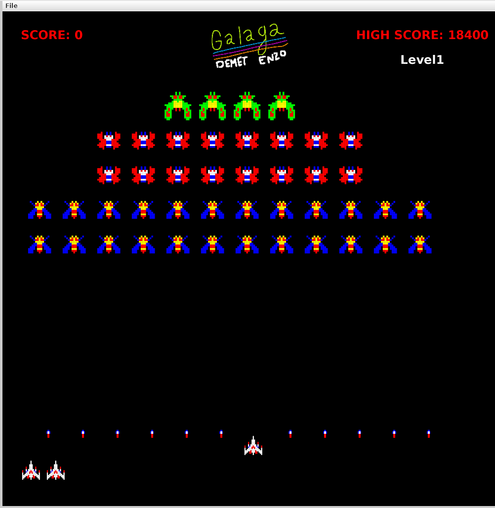

ROLANDIN Enzo binôme 1 
LE GAL Demet binôme 2

# PROJET GALAGA - CLONE DE JEU

## Explication des fonctionnalités réalisées :

1. SYSTÈME DE JEU PRINCIPAL

   - Boucle de jeu en temps réel (30ms par frame)
   - Double buffering pour un affichage fluide
   - Système de score et de highscore persistant (sauvegardé dans un fichier)
   - Détection de game over et possibilité de recommencer (touche Esc)
   - Fenêtre de jeu de 1000x1000 pixels

2. SYSTÈME DE NIVEAUX

   - Gestionnaire de niveaux avec chargement depuis fichiers .lvl
   - Plusieurs niveaux disponibles (level1.lvl, level2.lvl)
   - Progression automatique entre les niveaux
   - Affichage du nom du niveau en cours
   - Détection de fin de niveau (tous les ennemis éliminés)

3. JOUEUR (VAISSEAU)

   - Déplacement horizontal avec les flèches directionnelles
   - Système de tir avec la barre d'espace
   - Cooldown entre les tirs (attackSpeed configurable)
   - Système de vies avec affichage visuel
   - Restriction des mouvements dans les limites de l'écran
   - Sprite personnalisé (ship.spr)

4. ENNEMIS

   - Plusieurs types d'ennemis avec comportements uniques :
     - Bee (Abeille) : ennemi de base
     - Butterfly (Papillon) : ennemi avec mouvement spécifique
     - Moth (Papillon de nuit) : ennemi avec pattern différent
     - Boss : ennemi plus résistant avec plus de points
   - Système de points différent selon le type d'ennemi
   - Formation de groupe et mouvement coordonné
   - Système de tir ennemi (missiles vers le bas)
   - Détection des alliés en dessous avant de tirer
   - Sprites personnalisés pour chaque type d'ennemi

5. SYSTÈME DE COMBAT

   - Missiles du joueur (vers le haut)
   - Missiles ennemis (vers le bas)
   - Détection de collision entre missiles et entités
   - Système de santé pour toutes les entités
   - Animation de dégâts

6. INTERFACE UTILISATEUR

   - Affichage du score en temps réel (coin supérieur gauche)
   - Affichage du highscore (coin supérieur droit)
   - Logo du jeu au centre en haut
   - Nom du niveau actuel affiché
   - Écran de game over avec instructions
   - Police et couleurs personnalisées (rouge pour les textes importants)

7. SYSTÈME D'ENTITÉS

   - Classe Entity de base pour tous les objets du jeu
   - Système de position avec Vector2 (coordonnées normalisées 0-1)
   - Interpolation lisse des mouvements (lerp)
   - Système de sprite avec chargement depuis fichiers .spr
   - Gestion de la santé et des vies

8. UTILITAIRES
   - Vector2 : classe pour la gestion des vecteurs 2D
   - ColorUtils : utilitaires pour la gestion des couleurs
   - EntityUtils : utilitaires pour les entités
   - StdDraw : bibliothèque graphique pour l'affichage

## Fonctionnalités supplémentaires :

- Sauvegarde automatique du highscore dans un fichier
  (ressources/highscore/highscore.sc)
- Chargement automatique du highscore au démarrage
- Système de cooldown pour les attaques (joueur et ennemis)
- Système de formation d'ennemis
- Détection intelligente des alliés pour éviter le tir ami
- Documentation Javadoc complète générée (dossier javadoc/)
- Architecture modulaire avec séparation claire des responsabilités
  (engine, game, actors, levels, utils)

## Guide d'exécution du projet :

PRÉREQUIS :

- Java JDK 8 ou supérieur installé
- Terminal ou invite de commande

MÉTHODE 1 : Compilation et exécution manuelle

1.  Ouvrir un terminal dans le dossier racine du projet
2.  Compiler le projet :
    javac -d bin -sourcepath src src/engine/App.java
3.  Exécuter le jeu :
    java -cp bin engine.App

MÉTHODE 2 : Utilisation d'un IDE (recommandé)

1.  Ouvrir le projet dans votre IDE (Eclipse, IntelliJ IDEA, VS Code)
2.  Configurer le projet Java avec le dossier "src" comme source
3.  Exécuter la classe principale : engine.App
4.  Le jeu se lance automatiquement

MÉTHODE 3 : Depuis VS Code

1.  Ouvrir le dossier du projet dans VS Code
2.  Appuyer sur F5 ou utiliser le menu "Run > Start Debugging"
3.  Sélectionner "Java" si demandé
4.  Le jeu se lance automatiquement

STRUCTURE DES FICHIERS :

- src/ : Code source du projet
- bin/ : Fichiers compilés (.class)
- ressources/ : Ressources du jeu (sprites, niveaux, highscore, logo)
- javadoc/ : Documentation générée du code

## Description de l'interface pour jouer avec votre projet :

ÉCRAN DE JEU :

## CONTRÔLES DU JEU :

← Flèche GAUCHE : Déplacer le vaisseau vers la gauche
→ Flèche DROITE : Déplacer le vaisseau vers la droite
⎵ ESPACE : Tirer un missile vers le haut
ESC : Recommencer la partie après un game over

## OBJECTIF DU JEU :

- Éliminer tous les ennemis pour passer au niveau suivant
- Éviter les missiles ennemis
- Ne pas perdre toutes vos vies
- Obtenir le meilleur score possible !

## SYSTÈME DE SCORE :

- Chaque type d'ennemi rapporte un nombre de points différent
- Boss : plus de points (ennemi plus résistant)
- Bee, Butterfly, Moth : points variables selon le type
- Le highscore est sauvegardé automatiquement

## CONSEILS :

- Visez les ennemis du bas en premier (ils bloquent les tirs)
- Déplacez-vous constamment pour éviter les missiles
- Gérez votre cadence de tir (cooldown entre les tirs)
- Observez les patterns de déplacement des ennemis

## GAME OVER :

Lorsque vous perdez toutes vos vies, l'écran "GAME OVER" s'affiche.
Appuyez sur ESC pour recommencer une nouvelle partie.

===============================================================================
BON JEU !
===============================================================================
